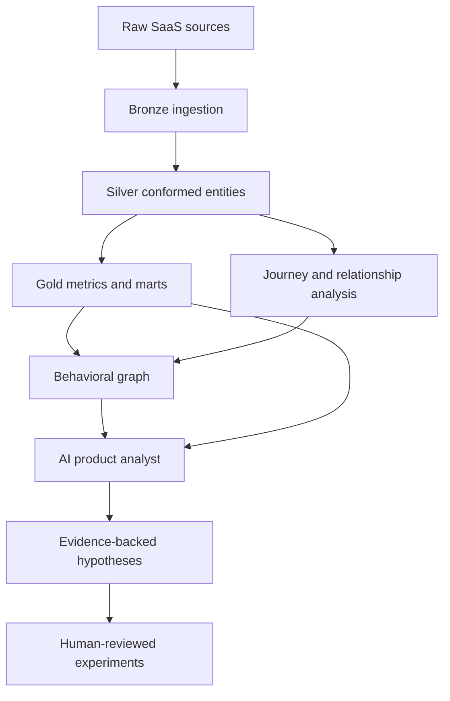

# AI Product Analytics Graph

> Turn raw product usage events into behavioral graphs, evidence-backed
> insights, and testable product hypotheses.

This project explores whether graph-based behavioral modeling can help product
teams discover relationships that are difficult to see in traditional funnels,
dashboards, and cohort reports. The system is designed to reconstruct customer
journeys, calculate metrics deterministically, represent behavioral
relationships as a graph, and give an AI analyst structured access to evidence.

The goal is not to replace conventional product analytics. It is to add a
relationship-discovery layer that helps teams move from metrics to
observations, hypotheses, and experiments.

## Current status

The repository currently contains a synthetic raw-data snapshot and the design
documentation for the planned platform. The data and documentation support the
source model and target analytical outputs, but the executable transformation
pipeline, graph model, chatbot, and materialized Bronze, Silver, and Gold
tables have not been added yet.

## Problem

Traditional analytics is effective when the question is already known:

- What is signup-to-paid conversion?
- Which features have the highest adoption?
- What is the MRR movement this month?
- Which acquisition channels produce paying customers?

It is less effective for relationship questions:

- Which feature behaviors distinguish converters from non-converters?
- Do different customer segments follow different successful journeys?
- Which behaviors connect adoption, conversion, and retention?
- Where do high-intent users abandon their journey?
- Which observed relationship deserves a product experiment?

The core product question is:

> Can product usage data be transformed into a behavioral graph that an AI
> analyst can investigate to identify evidence-backed growth opportunities?

## Product

The planned system will:

1. Load usage events and supporting user, feature, attribution, and subscription
	 data.
2. Normalize the sources and reconstruct customer journeys.
3. Calculate canonical product and revenue metrics deterministically.
4. Detect transitions, sequences, co-occurrence, and outcome relationships.
5. Build a behavioral graph with evidence-bearing edges.
6. Give an AI analyst access to relevant graph neighborhoods and metrics.
7. Produce observations, product hypotheses, and candidate experiments.
8. Preserve the evidence behind every AI-generated conclusion.

An output should look like this:

**Observation:** Users who adopt a feature before conversion convert at a
different rate from the relevant baseline.

**Evidence:** The system shows the cohort size, adoption timing, conversion
rate, MRR, and segment differences used to reach the observation.

**Interpretation:** The AI proposes plausible explanations without presenting
correlation as causation.

**Hypothesis:** A specific product change may help more users reach the
valuable behavior.

**Experiment:** The system proposes a primary metric, secondary metrics, and a
guardrail.

## Data in this repository

The raw snapshot is synthetic and intended for development and demonstration,
not as a benchmark for real-world SaaS performance.

| Source | Grain | Planned use |
| --- | --- | --- |
| `data/raw/user_signups.jsonl` | One user signup | User dimension, signup cohorts, firmographics |
| `data/raw/feature_usage_events.jsonl` | One feature interaction | Usage facts, weekly engagement, journeys |
| `data/raw/feature_releases.json` | One feature release or upgrade | Feature version history and availability |
| `data/raw/marketing_attribution.jsonl` | One first-touch attribution | Channel performance and acquisition cohorts |
| `data/raw/conversions.jsonl` | One free-to-paid conversion | Conversion outcomes and time to convert |
| `data/raw/subscription_events.jsonl` | One subscription lifecycle event | Periodized subscriptions, churn, expansion, and MRR |

The source files connect through `user_id`; feature usage and releases connect
through `feature_id`. This supports the documented questions about adoption,
conversion, acquisition quality, subscription movement, and engagement.

`data/raw/_feature_users_metadata.json` is an auxiliary legacy artifact. It is
not part of the documented lineage or table contracts and should not be used as
a pipeline source until its schema and purpose are formally documented.

The current files are inputs only. The paths such as `data/bronze`,
`data/silver`, and `data/gold` in the data dictionary describe target outputs,
not directories currently present in the repository.

## Target architecture



The planned medallion layers are:

- **Bronze:** source records landed with ingestion metadata.
- **Silver:** user dimensions, feature states, usage facts, and periodized
	subscription states.
- **Gold:** channel performance, feature-conversion impact, MRR waterfall, and
	weekly engagement marts.

The architecture deliberately separates measurement from interpretation.
Canonical metrics and relationship calculations should be produced by
deterministic code. The AI should investigate, explain, and generate
hypotheses, not silently recalculate business metrics from raw events.

## Analytical workflows

### Journey reconstruction

Events will be ordered into user journeys so the system can compare paths,
transition frequencies, time between steps, successful journeys, abandoned
journeys, and repeated loops. The current event source provides timestamps,
users, features, and event types; explicit session identifiers are not present
in the snapshot, so session reconstruction will need a defined time-window
rule.

### Deterministic metrics

The documented marts provide the first governed metric surface:

- channel signups, conversions, conversion rate, and new MRR;
- feature adoption and conversion outcomes by cohort;
- new business, expansion, contraction, churn, and NRR;
- weekly active users, event volume, and engagement intensity.

### Relationship discovery

The graph can later represent relationships such as:

- `PRECEDES` between journey behaviors;
- `CO_OCCURS_WITH` between features;
- `ASSOCIATED_WITH` conversion or retention outcomes;
- `DROPS_BEFORE` abandonment points;
- segment-specific behavior and outcome differences.

Edges should carry evidence such as user count, transition rate, conversion or
retention rate, lift, time window, and segment. The graph complements the event
store; it does not replace it.

## AI and trust model

The AI analyst should receive structured context: metric definitions, governed
results, relevant graph neighborhoods, relationship evidence, and segment
information. It should not receive an unrestricted raw event stream as its
primary analytical interface.

The model may summarize evidence, compare relationships, explain possible
interpretations, and generate candidate hypotheses. Human review remains
required for causal interpretations, strategic conclusions, and experiment
recommendations.

Every insight should preserve this chain:

```text
Raw events -> calculated metric -> derived relationship -> graph evidence
					 -> AI interpretation -> product hypothesis -> human decision
```

Correlation is not causal proof. Sparse data, instrumentation gaps, common
events, and threshold choices can all produce misleading relationships.

## Demo questions

The intended demo should answer questions such as:

- Which early behaviors distinguish users who convert from those who do not?
- Which features are associated with higher conversion or retention?
- Which acquisition channels bring customers with stronger downstream value?
- How does MRR change through new business, expansion, contraction, and churn?
- Where do high-intent users appear to abandon their journey?
- Do different company sizes or industries follow different successful paths?

The data snapshot supports the first four questions directly through the
documented marts. Journey abandonment and richer path comparisons require the
journey and graph layers to be implemented.

## Why a graph and an AI analyst?

Tables and SQL are excellent for aggregation. Graphs are useful when the
question is about relationships: what tends to happen before an outcome,
which behaviors connect adoption and conversion, and which paths distinguish
successful users.

The graph is an additional analytical representation, not a replacement for
the event store or governed metrics. Raw event streams are large and
repetitive, so the pipeline should reduce behavior to structured evidence
before an AI model interprets it.

The core boundary is:

> Use deterministic systems for facts and calculations. Use the model for
> interpretation and hypothesis generation.

## Evaluation

A convincing demo is not enough. The analytical and AI layers should have
reproducible evaluation.

### Relationship evaluation

The synthetic data is intended to contain known signals, including feature
adoption effects on conversion, channel differences, and retention patterns.
Evaluation should measure:

- relationship precision and recall;
- recovery of known paths and segments;
- ranking quality for surfaced opportunities;
- false high-confidence relationships.

Only measured results should be published. The current repository contains the
raw snapshot and design decisions, not an evaluation runner or benchmark.

### AI insight evaluation

Candidate criteria include grounding in evidence, numerical fidelity,
causality discipline, product relevance, experiment quality, and completeness
of evidence references.

## Observability

Every future AI analysis should produce a trace containing the user question,
metric and graph queries, retrieved evidence, model calls, errors, latency,
token usage, final evidence, and generated hypothesis. Sensitive values should
be redacted.

The objective is to make the analytical process inspectable rather than present
an unexplained AI insight.

## Documentation

- [Data dictionary](docs/data_dictionary.md): target Bronze, Silver, and Gold
	schemas, grains, columns, and upstreams.
- [Data lineage](docs/lineage.md): target flow from raw files to analytical
	marts; [lineage.json](docs/lineage.json) is the machine-readable version.
- [Architecture decisions](docs/adr/): decisions about lakehouse layers,
	validation, orchestration, synthetic signals, subscription modeling,
	contracts, semantic metrics, and the chatbot.
- [Project references](references.md): related open-source projects and tools.

The data dictionary and lineage are design artifacts generated from contracts
in the target architecture. The contracts, generation scripts, transformation
jobs, semantic layer, and chatbot are not present yet, so the documentation
should be read as the implementation specification.

## Roadmap

### Phase 1: Data foundation

- Add source contracts and a reproducible synthetic-data generator.
- Add Bronze ingestion and raw-data validation.
- Build the Silver user, feature, usage, and subscription models.

### Phase 2: Metrics and relationships

- Build the documented Gold marts.
- Add journey reconstruction and transition analysis.
- Create weighted graph nodes and edges with evidence.

### Phase 3: AI product analyst

- Add governed metric and graph retrieval.
- Generate evidence-backed observations and hypotheses.
- Capture query and reasoning traces for review.

### Phase 4: Evaluation

- Test recovery of the synthetic signals described in
	[ADR 0004](docs/adr/0004-synthetic-data-with-engineered-signals.md).
- Add relationship precision, recall, and false-confidence checks.
- Evaluate AI grounding, numerical fidelity, causality discipline, and
	experiment quality.

## Limitations

This is an analytical prototype, not a causal inference engine. Synthetic data
may contain cleaner patterns than real products, and graph thresholds influence
which relationships are surfaced. Product hypotheses still require validation
through experiments and qualitative research.
