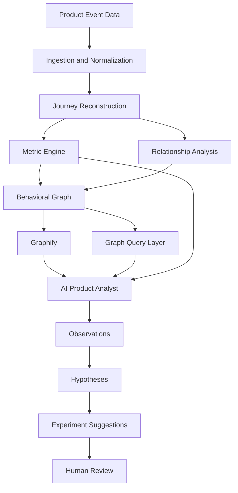

# AI Product Analytics Graph

> Turn raw product usage events into behavioral graphs, evidence-backed insights, and testable product hypotheses.

This project explores whether graph-based behavioral modeling can help product teams discover relationships that are difficult to see in traditional funnels, dashboards, and cohort reports.

The system reconstructs customer journeys from product usage events, calculates behavioral relationships deterministically, represents those relationships as a graph, and gives an AI analyst structured access to the resulting evidence.

The goal is not to replace conventional product analytics. It is to add a relationship-discovery layer that helps product teams move from metrics to observations, hypotheses, and experiments.

---

## Problem

Product teams collect detailed behavioral data such as:

- signup
- workspace creation
- feature usage
- integrations
- invitations
- project creation
- exports
- upgrades
- cancellations

Traditional analytics tools are effective when the question is already known:

- What is signup-to-paid conversion?
- Where does a funnel drop?
- Which features have the highest adoption?
- What is D30 retention?

They are less effective at exploring broader relationship questions:

- Which behaviors distinguish activated users from users who fail to activate?
- Which event sequences are associated with conversion?
- Do different customer segments follow different successful journeys?
- Which features appear as bridges between activation and retention?
- Which high-intent users still fail to convert, and where?
- Which combinations of behavior deserve a product experiment?

Answering these questions manually usually requires repeated SQL analysis, segmentation, funnel definitions, and analyst investigation.

The core product question is:

> Can product usage data be transformed into a behavioral graph that an AI analyst can investigate to identify evidence-backed product opportunities?

---

## Product

The system converts raw product usage data into a graph of customer journeys, behavioral relationships, product outcomes, and supporting metrics.

A typical workflow:

1. Load product events and supporting user, account, plan, or subscription data.
2. Normalize events into a consistent schema.
3. Reconstruct sessions and customer journeys.
4. Calculate canonical product metrics deterministically.
5. Detect transitions, sequences, co-occurrence, and outcome relationships.
6. Build a behavioral graph.
7. Use Graphify to represent and visualize graph structure.
8. Give an AI analyst access to relevant graph neighborhoods and metrics.
9. Generate observations, product hypotheses, and candidate experiments.
10. Preserve the evidence behind every AI-generated conclusion.

The intended output is not:

> Feature X seems important.

It should instead produce a structured analysis:

**Observation**  
Users who perform a specific sequence of actions convert at a materially different rate from the baseline.

**Evidence**  
The system shows the path, cohort size, transition rates, outcome rates, and relevant segment differences.

**Interpretation**  
The AI proposes one or more plausible product explanations without presenting correlation as causation.

**Hypothesis**  
A specific product change may increase the probability that more users reach the valuable behavior.

**Experiment**  
The system proposes a test, primary metric, secondary metric, and guardrail.

---

## Demo

The demo should make the project understandable before the reader inspects the code.

Example questions:

### Activation

> Which early behaviors most clearly distinguish activated from non-activated users?

### Conversion

> What actions or event sequences are most strongly associated with trial-to-paid conversion?

### Retention

> Which behaviors in the first week are disproportionately present among users retained after 30 days?

### Journey discovery

> What are the most common successful paths from signup to a key product outcome?

### Drop-off

> Where do high-intent users appear to abandon their journey?

### Segmentation

> Do different customer segments follow materially different successful paths?

### Opportunity discovery

> Where do high traffic, high drop-off, and strong downstream value occur together?

Recommended demo assets:

- one behavioral graph screenshot
- one AI analysis with visible evidence
- one journey comparison
- one short trace showing how the analyst reached its conclusion
- one evaluation result

---

## Architecture



The architecture deliberately separates measurement from interpretation.

Canonical metrics, counts, rates, cohorts, and relationship calculations are produced by deterministic code.

The AI is used for investigation, synthesis, explanation, and hypothesis generation.

---

## Core Workflows

### 1. Event ingestion

Input data is normalized into a common event structure.

Example:

```json
{
  "user_id": "u_1842",
  "event": "workspace_created",
  "timestamp": "2026-04-12T14:32:10Z",
  "session_id": "s_821",
  "properties": {
    "device": "desktop"
  }
}
```

Supporting data may include:

- users
- accounts
- plans
- subscriptions
- experiments
- acquisition channel
- company attributes

The architecture is intentionally not coupled to one specific source dataset.

### 2. Journey reconstruction

Events are ordered into user journeys and sessions.

Example:

```text
signup
  ↓
workspace_created
  ↓
integration_connected
  ↓
project_created
  ↓
feature_used
  ↓
subscription_started
```

The system can calculate:

- event transitions
- path frequencies
- time between steps
- successful journeys
- abandoned journeys
- repeated loops
- path differences between cohorts

### 3. Deterministic product metrics

Canonical metrics are calculated in code or SQL.

Examples:

- activation rate
- trial-to-paid conversion
- D7 retention
- D30 retention
- feature adoption
- churn rate
- time to activation
- time to value
- revenue metrics where available

These calculations are the source of truth.

The AI does not independently calculate canonical business metrics from raw event text.

### 4. Relationship discovery

The system looks beyond predefined funnels.

Possible analyses include:

**Sequential relationships**

```text
A → B
A → B → C
A → C → D
```

**Behavioral co-occurrence**

```text
Feature A ↔ Feature C
```

**Outcome relationships**

```text
Behavior A → higher conversion
Behavior B → higher retention
Path X → lower churn
```

**Segment differences**

```text
Segment A:
signup → template → project → paid

Segment B:
signup → integration → invite → project → paid
```

Only relationships that meet defined evidence thresholds should be added to the graph.

### 5. Graph construction

The graph represents product behavior as relationships rather than only rows and aggregates.

Possible node types:

- Event
- Feature
- JourneyStage
- UserSegment
- Plan
- AcquisitionChannel
- Experiment
- Metric
- Outcome
- Hypothesis

Possible relationship types:

- PRECEDES
- FOLLOWED_BY
- CO_OCCURS_WITH
- USED_BY
- OVER_INDEXES_ON
- ASSOCIATED_WITH
- CONVERTS_TO
- DROPS_BEFORE
- RETAINED_AFTER
- EXPOSED_TO

Edges can carry evidence such as:

- user count
- transition rate
- median time between events
- conversion rate
- retention rate
- lift
- confidence
- segment
- observation window

Graphify is used for graph representation and visualization.

The graph complements the underlying event store rather than replacing it.

### 6. AI investigation

The AI analyst receives structured context such as:

- product definitions
- event taxonomy
- metric definitions
- relevant graph neighborhood
- relationship evidence
- segment information
- statistical summaries
- experiment context where available

Instead of sending large raw event streams to the model, the system provides the smallest useful evidence set for the current question.

The AI can then:

- compare relationships
- navigate neighboring nodes
- connect evidence across metrics
- identify unusual paths
- explain possible interpretations
- generate product hypotheses
- propose experiments

---

## AI Design Decisions

| Decision | Choice | Why |
|---|---|---|
| Metric calculation | Deterministic | Canonical metrics must be reproducible |
| Relationship calculation | Deterministic | Evidence should not depend on LLM interpretation |
| Graph model | Structured | Relationships become explicit and traversable |
| Graph layer | Graphify | Provides graph representation and visualization |
| Product interpretation | LLM | Interpretation requires contextual reasoning and synthesis |
| Hypothesis generation | LLM | Several plausible explanations may exist |
| Context strategy | Graph + metrics | Reduces context size while preserving evidence |
| Final product decisions | Human-reviewed | Correlation is not sufficient for autonomous decision-making |
| Agent architecture | Single analyst first | Easier to evaluate, trace, and improve |

The core principle is:

> Use deterministic systems for facts and calculations. Use the model for interpretation.

### Why a graph?

Tables and SQL are excellent for aggregation.

Graphs are useful when the question is about relationships:

- What tends to happen before a key outcome?
- Which behaviors connect activation and retention?
- Which events act as bridges between journey stages?
- Which paths distinguish successful users?
- Which features occur together in high-value journeys?

The graph is an additional analytical representation, not a replacement for conventional analytics.

### Why not send raw events directly to the LLM?

Raw event streams are:

- large
- repetitive
- expensive as context
- difficult to reason about reliably
- poor at preserving exact statistical relationships

The pipeline reduces raw behavior into structured evidence before the model interprets it.

### Why AI?

The difficult part is not calculating another funnel.

The difficult part is investigating a connected evidence space and turning observations into useful product hypotheses.

That is where the model adds value.

---

## Safety and Trust Model

This system does not execute product changes autonomously.

Its main risks are analytical rather than operational:

- overstating correlation as causation
- inventing unsupported explanations
- ignoring contradictory evidence
- misreading sparse data
- presenting model interpretation as measured fact

### Autonomous

The system may:

- ingest data
- reconstruct journeys
- calculate metrics
- calculate transitions
- construct graph relationships
- retrieve graph neighborhoods
- summarize evidence
- generate candidate hypotheses

### Requires human review

A human should review:

- causal interpretations
- strategic product conclusions
- experiment recommendations
- prioritization suggestions

### Not trusted to the model

The model should not:

- redefine canonical metrics silently
- invent missing data
- modify source data
- hide contradictory evidence
- present unsupported relationships as facts
- treat statistical association as causal proof

The intended boundary is:

> Give the model analytical autonomy, not product decision authority.

### Provenance

Every insight should preserve the chain from source data to recommendation:

```text
Raw events
    ↓
Calculated metric
    ↓
Derived relationship
    ↓
Graph evidence
    ↓
AI interpretation
    ↓
Product hypothesis
    ↓
Human decision
```

A reviewer should always be able to answer:

> Why did the system say this?

---

## Evaluation

A convincing demo is not enough.

The project should include reproducible evaluation for both the analytical layer and the AI layer.

### Relationship evaluation

If the selected synthetic dataset contains known embedded behavioral patterns, the system can be tested on whether it rediscovers them.

Potential metrics:

- relationship precision
- relationship recall
- path recovery
- segment recovery
- ranking quality
- false high-confidence relationships

Example evaluation format:

```text
Known relationships:        TBD
Correctly discovered:       TBD
Missed:                     TBD
False high-confidence:      TBD
```

Only actual measured results should be published.

### AI insight evaluation

Candidate rubric:

**Grounding**  
Is the insight supported by graph or metric evidence?

**Numerical fidelity**  
Does the explanation preserve calculated values correctly?

**Causality discipline**  
Does the analysis distinguish association from causation?

**Product relevance**  
Does the hypothesis suggest a plausible product intervention?

**Experiment quality**  
Is the proposed experiment logically connected to the observed behavior?

**Metric quality**  
Are success and guardrail metrics appropriate?

**Evidence completeness**  
Does the analysis acknowledge contradictory or weak evidence where relevant?

### Evaluation structure

```text
evals/
├── cases/
├── expected/
├── rubrics/
├── runner.py
└── README.md
```

Each case should define:

- question
- available evidence
- expected observations
- acceptable interpretations
- unsupported conclusions
- scoring criteria

---

## Observability

Every AI analysis should produce a trace.

A trace should capture:

- user question
- analytical goal
- metric queries
- graph queries
- retrieved nodes
- retrieved edges
- model calls
- errors
- retries
- latency
- token usage
- final evidence
- generated hypothesis

Example flow:

```text
Question
  ↓
Metric query
  ↓
Graph query
  ↓
Relevant relationships
  ↓
Additional investigation
  ↓
AI interpretation
  ↓
Hypothesis
  ↓
Evidence references
```

The objective is to make the analytical process inspectable rather than presenting unexplained "AI insights."

Sensitive values should be redacted from traces.

---

## Running Locally

Target setup:

```bash
git clone <repository-url>
cd ai-product-analytics-graph

python -m venv .venv
source .venv/bin/activate

pip install -r requirements.txt

cp .env.example .env

python scripts/load_sample_data.py
python scripts/build_graph.py
python app.py
```

Exact commands will be finalized with the implementation.

The repository should include safe sample data so that the core demo can be inspected without access to a proprietary analytics platform.

---

## Limitations

This project is an analytical prototype, not a causal inference engine.

Known limitations include:

- correlation does not establish causality
- synthetic data may contain cleaner patterns than real products
- instrumentation quality directly affects analysis quality
- sparse events can produce misleading relationships
- common events may dominate graph structure
- graph complexity grows with event vocabulary
- threshold choices influence discovered relationships
- AI interpretation can still overstate ambiguous evidence
- product hypotheses still require validation through experiments or research

The graph should therefore be treated as a hypothesis-discovery mechanism, not an automated product decision system.

---

## Roadmap

### Phase 1: Behavioral foundation

- select public or synthetic product event dataset
- normalize events
- reconstruct journeys
- calculate activation, conversion, retention, and churn
- generate transition graph

### Phase 2: Relationship graph

- sequence analysis
- co-occurrence analysis
- segment-specific relationships
- weighted graph edges
- Graphify visualization
- graph querying

### Phase 3: AI Product Analyst

- natural-language analysis
- graph-neighborhood retrieval
- evidence-backed observations
- hypothesis generation
- experiment suggestions
- evidence citations

### Phase 4: Evaluation

- synthetic ground-truth benchmark
- relationship discovery benchmark
- AI insight rubric
- regression suite
- trace evaluation

### Phase 5: Deeper product intelligence

Potential additions:

- experiment-result relationships
- temporal graph changes
- cohort comparison
- anomaly detection
- graph community detection
- feature centrality analysis
- churn-path analysis
- opportunity scoring
- MCP interface for external AI agents

---

## Repository Structure

```text
/
├── README.md
├── LICENSE
├── CHANGELOG.md
├── ROADMAP.md
│
├── data/
│   ├── sample/
│   └── README.md
│
├── src/
│   ├── ingestion/
│   ├── journeys/
│   ├── metrics/
│   ├── relationships/
│   ├── graph/
│   └── analyst/
│
├── sql/
│   ├── activation.sql
│   ├── conversion.sql
│   └── retention.sql
│
├── knowledge/
│   ├── event_taxonomy.md
│   ├── metric_definitions.md
│   └── product_context.md
│
├── evals/
│   ├── cases/
│   ├── expected/
│   └── runner.py
│
├── examples/
├── docs/
│   ├── architecture.md
│   ├── decisions/
│   └── images/
│
├── tests/
├── scripts/
└── .env.example
```

---

## What This Project Explores

The project is ultimately testing one idea:

> Can graph-based behavioral modeling give AI a better representation of product usage than dashboards, isolated funnels, or raw event streams alone?

If successful, the result is not another analytics dashboard.

It is an AI product analyst that can investigate how product behaviors relate, explain the evidence it finds, and turn those observations into testable product hypotheses.
